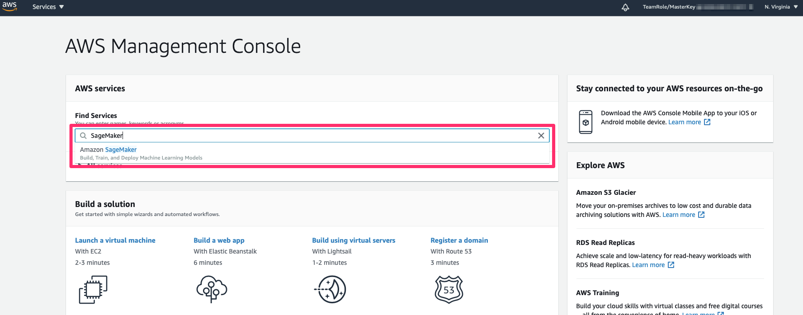
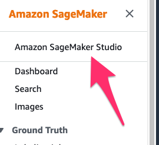
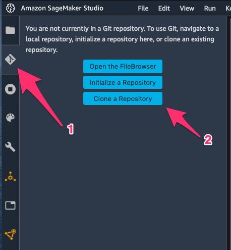
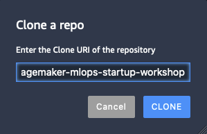
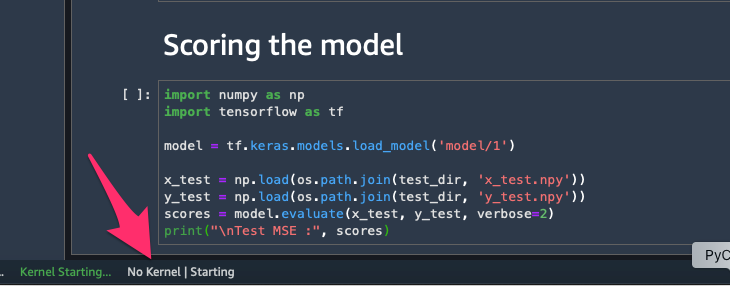
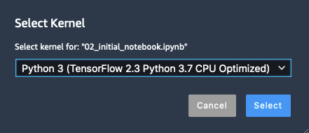

# MLOps workshop with Amazon SageMaker

## 1. Launch SageMaker Studio

Open the [AWS Management Console](https://console.aws.amazon.com/console/home)

**Note:** This workshop has been tested on the Europe (Frankfurt) eu-central-1 region. Make sure that you see **Frankfurt** on the top right hand corner of your AWS Management Console. If you see a different region, click the dropdown menu and select Frankfurt.

In the AWS Console search bar, type `SageMaker` and select `Amazon SageMaker` to open the service console.

. 

Now, open SageMaker Studio:

Click "Open Studio": (the first time you open SageMaker Studio this step might take few minutes to launch)

## 2. Clone the GitHub Repo
Click the Git icon (1 in the picture) and then select `Clone a repository` (step 2).

Type in the URL of this repository (https://github.com/Crayon-Group-AS/amazon-sagemaker-immersion-day) and click `Clone`.

## 3. Start the Workshop!

In the File Browser, double click `amazon-sagemaker-immersion-day`, then `labs` and open the `01_initial_notebook.ipynb` Jupyter notebook.

Select the "Python 3 (TensorFlow 2.3 Python 3.7 CPU Optimized)" Kernel by clicking "No Kernel" at the bottom. 

Then wait until the kernel has started. This step might take few minutes to launch.

Start the workshop!

